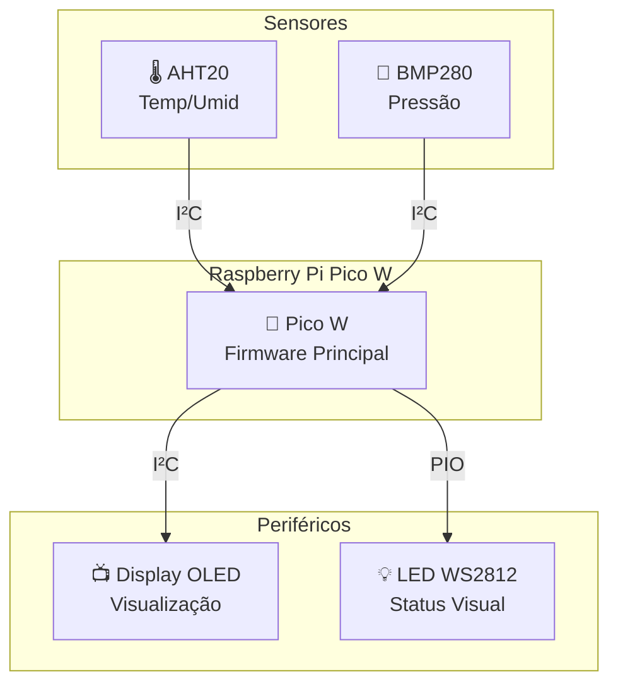

# Estação Meteorológica Inteligente ☁️

**Estação Meteorológica com Pico W** é um firmware de monitoramento climático construído sobre a  **Raspberry Pi Pico W** . O projeto utiliza múltiplos sensores para coletar dados do ambiente e os exibe localmente em tempo real. Ele oferece:

* **Coleta de Dados Precisa** com sensores AHT10 (temperatura e umidade) e BMP280 (temperatura e pressão atmosférica).
* **Visualização Instantânea** das leituras em um display OLED SSD1306.
* **Feedback Visual com LED RGB** controlado via PIO (Programmable I/O) para indicar o status do sistema.
* **Firmware Robusto em C/C++** utilizando o Pico SDK para performance e baixo consumo de energia.

> Projeto de código aberto mantido por **Heitor Lemos** sob a Licença MIT.

## 📂 Estrutura do Repositório

| **Caminho**                | **Descrição**                                                      |
| -------------------------------- | -------------------------------------------------------------------------- |
| `estacao_tu.c`                 | Código principal: inicializa hardware, lê sensores e gerencia a lógica. |
| `lib/`                         | Contém os drivers para os sensores e o display.                           |
| `lib/aht20.c`·`aht20.h`     | Driver I²C para o sensor de temperatura e umidade AHT20.                  |
| `lib/bmp280.c`·`bmp280.h`   | Driver I²C para o sensor de pressão atmosférica BMP280.                 |
| `lib/ssd1306.c`·`ssd1306.h` | Driver I²C para o display OLED SSD1306.                                   |
| `ws2812.pio`                   | Programa PIO para o controle do LED RGB WS2812.                            |
| `CMakeLists.txt`               | Script de build e configuração do projeto para o CMake.                  |
| `pico_sdk_import.cmake`        | Script do SDK para importação de dependências do Pico.                  |

## 🔧 Requisitos

### Hardware

| **Componente**           | **Qtde** | **Observação**                            |
| ------------------------------ | -------------- | ------------------------------------------------- |
| **Raspberry Pi Pico W**  | 1              | A conectividade Wi-Fi pode ser usada futuramente. |
| **Sensor AHT10**         | 1              | Medição de temperatura e umidade (I²C).        |
| **Sensor BMP280**        | 1              | Medição de pressão atmosférica (I²C).        |
| **Display OLED SSD1306** | 1              | Display I²C para visualização de dados.        |
| **LED RGB WS2812**       | 1              | (Opcional) Para feedback visual.                  |
| **Protoboard e Jumpers** | –             | Para montagem do circuito.                        |

### Software

| **Ferramenta**           | **Versão Mínima** |
| ------------------------------ | ------------------------- |
| **Pico SDK**             | 1.5.0+                    |
| **CMake**                | 3.13+                     |
| **GNU Arm Embedded GCC** | 10.3+                     |

## 📡 Diagrama do Sistema

O diagrama abaixo ilustra o fluxo de dados entre os componentes do hardware:



## ⚙️ Configuração e Compilação

### 1. Clonar o Repositório

```
git clone <URL_DO_SEU_REPOSITORIO>
cd <NOME_DA_PASTA>

```

### 2. Compilar o Projeto

No terminal, a partir da raiz do projeto, execute os seguintes comandos:

```
mkdir build
cd build
cmake ..
make -j$(nproc)

```

### 3. Flashing para o Pico W

1. Mantenha o botão **BOOTSEL** do Pico W pressionado.
2. Conecte o cabo USB ao seu computador e solte o botão.
3. O Pico será montado como um disco chamado `RPI-RP2`.
4. Arraste e solte o arquivo `build/estacao_tu.uf2` para dentro desse disco.

O Pico irá reiniciar automaticamente e começar a executar o código, exibindo os dados dos sensores no display OLED.

## 🤝 Contribuindo

Contribuições são bem-vindas! Se você tiver sugestões para melhorar o projeto, sinta-se à vontade para fazer um *fork* e abrir um  *Pull Request* .

1. Faça um Fork do projeto.
2. Crie sua Feature Branch (`git checkout -b feature/MinhaFeature`).
3. Faça o Commit de suas mudanças (`git commit -m 'Adiciona MinhaFeature'`).
4. Faça o Push para a Branch (`git push origin feature/MinhaFeature`).
5. Abra um Pull Request.

## 📝 Licença

Distribuído sob a  **Licença MIT** . Veja o arquivo [LICENSE](LICENSE) para mais detalhes.

## 📞 Contato

**Heitor Lemos**

🔗  **GitHub** : `https://github.com/TorRLD`
